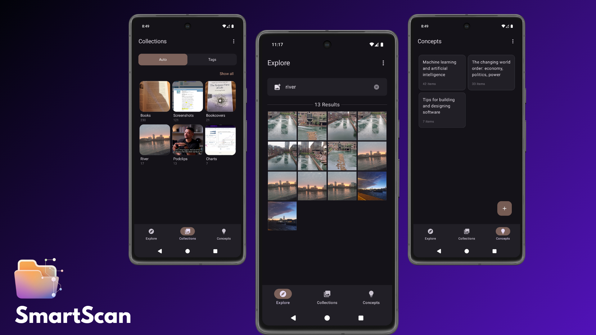
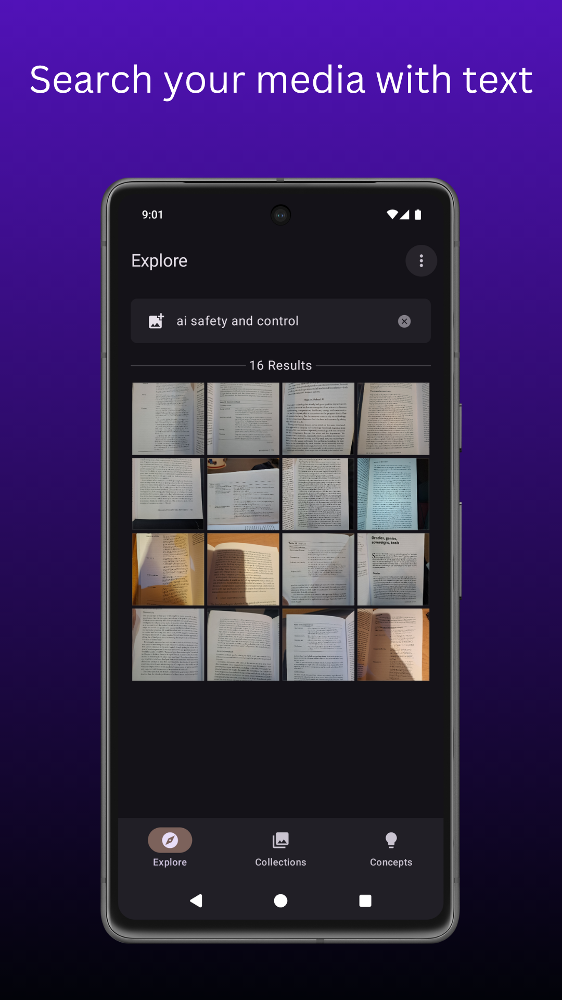
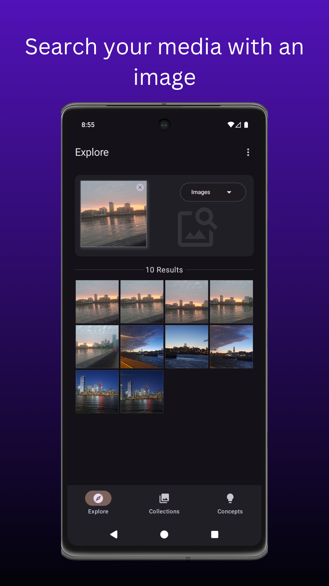
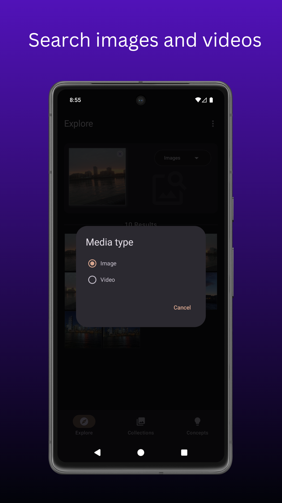
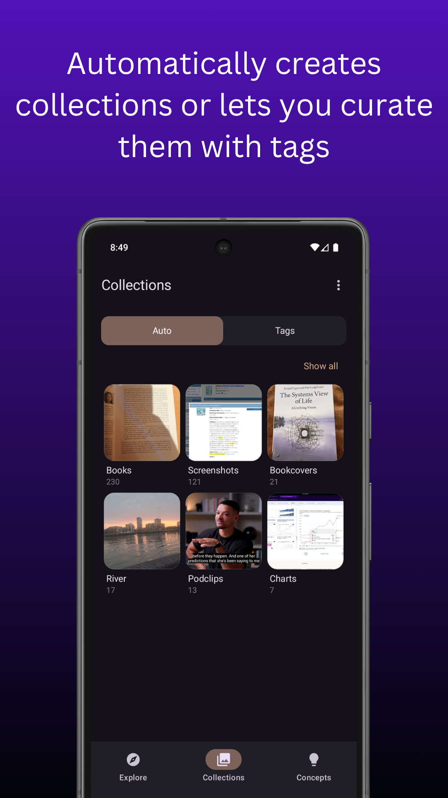
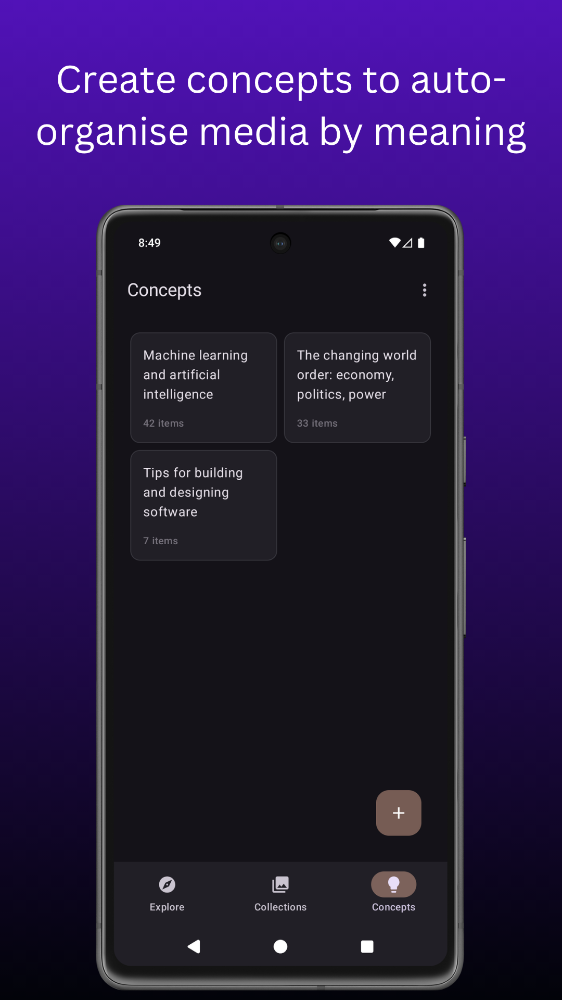
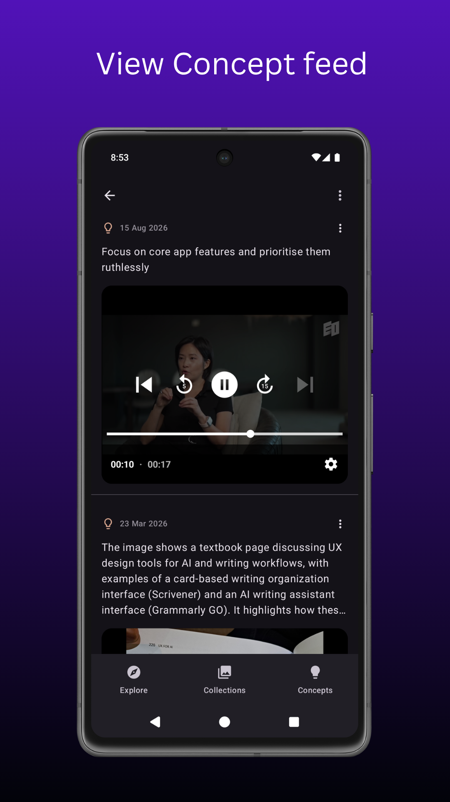
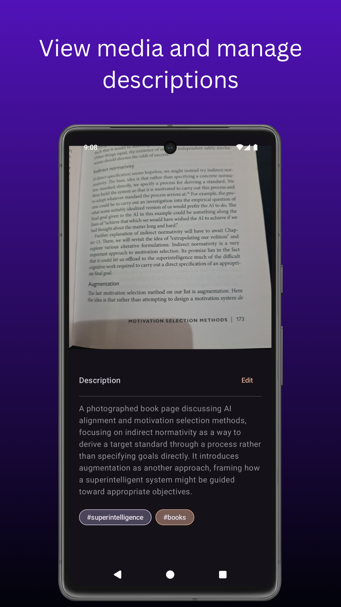
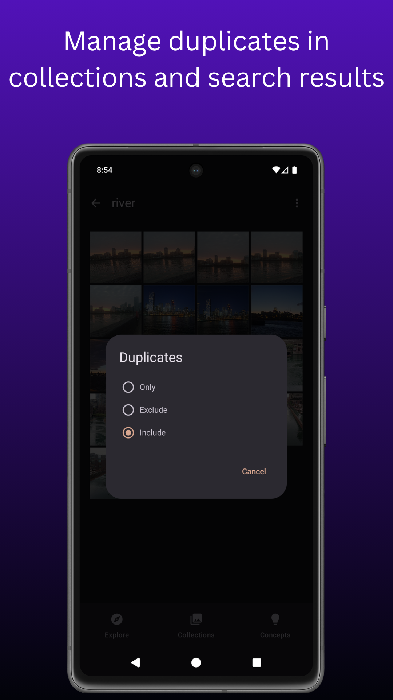

# SmartScan

Turn your images and videos into a personal knowledge base. Search, organise, and rediscover the screenshots, images, and videos you've saved, with media automatically grouped into collections and concepts.

  

|    |    |    |    |
|--------------------------------------------------------------------------------------------------------------|--------------------------------------------------------------------------------------------------------------|--------------------------------------------------------------------------------------------------------------|--------------------------------------------------------------------------------------------------------------|
|    |    |    |    |
| ------------------------------------------------------------------------------------------------------------ | ------------------------------------------------------------------------------------------------------------ | ------------------------------------------------------------------------------------------------------------ | ------------------------------------------------------------------------------------------------------------ |

---

## Buy Me A Coffee

The app is free, but if you enjoy using it and want to support project development and maintenance, consider donating using one of the options below.

### Donate with Kofi

### Donate with crypto

| Wallet   | Address                                     |
|----------|---------------------------------------------|
| Bitcoin  | bc1qw46nxjp5gkh460ewamjd3jfeu0xv6ytq5et6xm  |
| Ethereum | 0xa53aC18B25942C71019f85314AF67F6132E525ad  |
| Litecoin | ltc1q2hspfea9rw5j2ymvv22hx7dmckh8c99sqk7av3 |

---

## Key Features

All processing is handled on-device, ensuring privacy and offline functionality, with optional cloud processing for generating image descriptions.

### Search:
* Search images and videos
* Search using text or images
* Search by tag
* Search by tag + text query
* Search from other apps via share/intent
* Search by pasting image in search bar

### Tagging:
* Add tags to media
* Tag autocomplete when searching or tagging

### Collections:
* Auto Collections: automatically groups similar media
* Tag Collections: manually curate collections using tags
* Manage Collections: Merge, move, delete, add tags.

### Concepts:
* Automatically group media by meaning using media descriptions, helping you rediscover information you've saved but forgotten about.
* Automatically generate image descriptions.
* Manually add or edit media descriptions.

### Duplicates:
* Detect duplicate media
* Filter media by duplicate status (include, exclude, detect)

___

## Download

Go to [Releases](https://github.com/dev-diaries41/smartscan/releases/latest) and download the latest apk.

  

---

## License

 * This project is licensed under the GNU General Public License, Version 3 (GPLv3).
 * See the LICENSE file for details.

---
